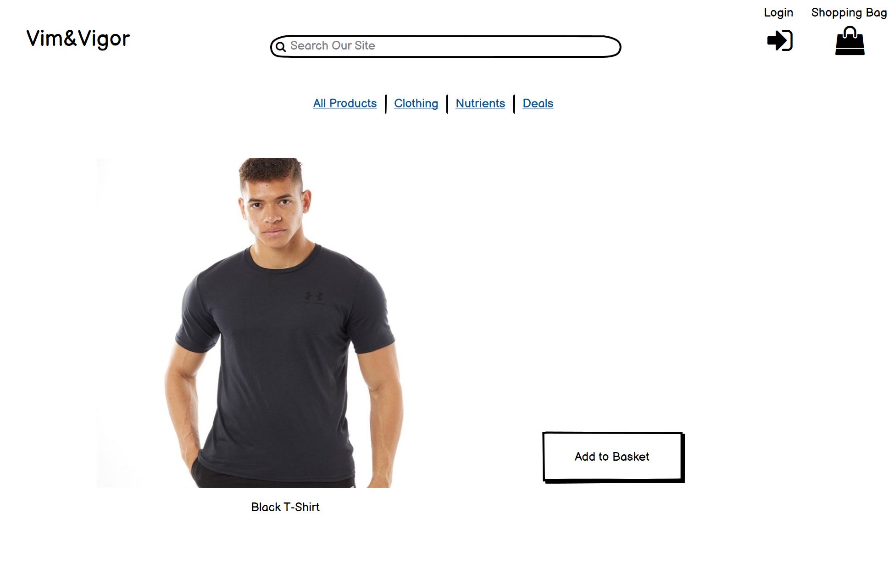
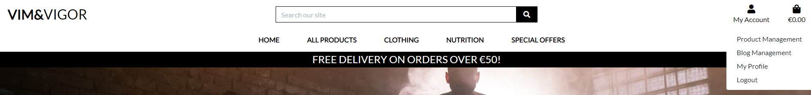
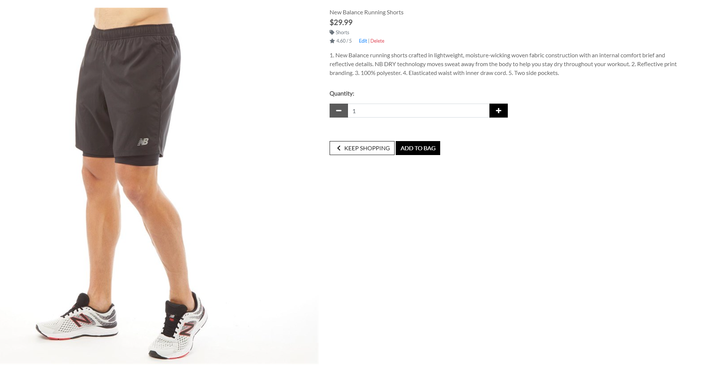

# E-Commerce Store

## Introduction

Welcome to my fifth project. This project is an e-commerce store to promote a healthy lifestyle. Users will be able to purchase clothes and nutrients from this website. This project will use languages and frameworks such as Django, Python, HTML, CSS and JavaScript.

In this project, I will set up an authentication mechanism and provide access to the site's data for users to purchase a range of products.

The admin of the website will also have the ability to use all CRUD functionality (Create, Read, Update, Delete).

A live website can be found [here](https://vim-vigor.herokuapp.com/).


# Table of Contents

# Table of Contents

-   [1. UX](#ux)
    -   [1.1. Strategy](#strategy)
        -   [Project Goals](#project-goals)
            -   [User Goals:](#user-goals)
            -   [User Expectations:](#user-expectations)
            -   [Trends of Modern Websites](#trends-of-modern-websites)
            -   [Strategy Table](#strategy-table)
    -   [1.2. Structure](#structure)
    -   [1.3. Skeleton](#skeleton)
    -   [1.4. Surface](#surface)
-   [2. Features](#features)
-   [3. Technologies Used](#technologies-used)
-   [4. Testing](#testing)
-   [5. Deployment](#deployment)
-   [6. SEO](#seo)
-   [7. Marketing](#marketing)
-   [8. Social Media](#social-media)
-   [9. End Product](#end-product)
-   [10. Known Bugs](#known-bugs)
-   [11. Credits](#credits)

<a name="ux"></a>

# 1. UX

[Go to the top](#table-of-contents)

As a gym goer I wanted to create a website that sells healthy items as well as training gear. Users will be able to access a blog which will promote health. This store will mainly focus on simplicity and user experience for the customers.

This project will showcase a range of products for users to purchase. The site will be clear and easily accessible. The best e-commerce stores display simply but clear navigation around the site, with an intuitive design.

<a name="strategy"></a>

## 1.1. Strategy

[Go to the top](#table-of-contents)

### Project Goals
One of the main goals of the project is to create a simple and intuitive store where customers can purchase items. Products will be presented in an elegant and easy view. All site users will be able to navigate around the website.

### User Goals:
First Time Visitor Goals
-   As a first-time visitor, I want to be able to view a list of products so that I can select some to purchase
-   As a first-time visitor, I want to view a specific category of products so that I can quickly find products I'm interested in without having to search through all products.
-   As a first-time visitor, I want to quickly identify deals so that I can take advantage of special savings on products I'd like to purchase.
-   As a first-time visitor, I want to search for a product key by name or description so that I can find a specific product I'd like to purchase.
-   As a first-time visitor, I want to view individual product details so that I can identify the price, description, product rating, product image and available sizes.
-   As a first-time visitor, I want to easily view the total of my purchases at any time so that I can avoid spending too much.
-   As a first-time visitor, I want to sort the list of available products so that I can easily identify the best rated, best priced and categorically sorted products.
-   As a first-time visitor, I want to sort a specific category of products so that I can find the best-priced or best-rated products in a specific category, or sort the products in that category by name.
-   As a first-time visitor, I want to easily add items to my basket so that I can view all the products I would like to purchase before completing payment.
-   As a first-time visitor, I want to easily remove items and update quantities from my basket so that I can remove any products I do not want before checking out.
-   As a first-time visitor, I want to easily select the size and quantity of a product when purchasing it so that I can ensure I don’t accidentally select the wrong product, quantity or size.
-   As a first-time visitor, I want to easily enter my payment information at the checkout page so that I can checkout with no issues.
-   As a first-time visitor, I want to feel safe and secure with my personal and payment information so that I can confidently provide the details to make a purchase.

Returning Visitor Goals
-   As a returning visitor, I want to create an account.
-   As a returning visitor, I want to update my user profile.
-   As a returning visitor, I want to view my order history.
-   As a returning visitor, I want to easily log in or logout so that I can access my personal account information.
-   As a returning visitor, I want to easily register for an account so that I can have a personal account and be able to view my profile.


Frequent User Goals
-   As a frequent user, I want to read up on the latest blog posts.

### User Expectations:
The website should have a simple user interface, with the navigation to each section clear and concise.

-   The user interface is easy to navigate.
-   The website is responsive on all devices.
-   To be able to see a clear selection of products.
-   Easily view the total of the basket before making any payment.
-   The website provides responsive feedback for any actions, for example when adding a product to the basket.

### User Stories
Throughout the project, I used the GitHub projects board to log all user stories as my project management tool. This helped me keep the focus on the necessary tasks as I would move them to the "in progress lane" as I'm working on the story. I would then move them to the "done" lane once the story has been completed. I would add new user stories during the project to keep track of the tasks that had to be done.

Start of project user story board:


In Progress user story board:


End of project the user story board:


### Strategy Table
Opportunity/Problem/Feature| Importance| Viability/Feasibility
------------ | -------------------------|---------
Ability to search for products | 5 | 5
Account signup | 5 | 5
User profile | 5 | 5
Responsive design | 5 | 5
Contact form | 4 | 5
Ability to add products to the basket | 5 | 5
Ability to make payment for the selected products | 5 | 5
Ability to rate products | 5 | 4
To view blog posts | 5 | 4
Filters on the products page | 3 | 2

Total | 47 | 45

## Scope
As I am unable to include all of the features from the strategy table. I will phase this project in multiple phases. Phase 1 will be what I have identified as a minimum viable product. Please find below the plans I have for each phase.

### Phase 1
- Display a range of health related products
- Allow users to register for an account
- Allow users to create and edit a personal profile
- Responsive design
- Contact form
- Ability to add/edit/delete products
- Ability to add/edit/blog posts
- Ability to subscribe and unsubscribe to a newsletter form
- Allow the customer to enter payment information securely

### Phase 2
- Add other health related products
- Add the ability for superusers to send our emails to newsletter subscribers
- Filter category by the key word

<a name="structure"></a>

# 1.2. Structure

[Go to the top](#table-of-contents)

It is really important to include responsive design in this project as many users are using different devices (mobile, tablet, laptop/PC). This gives the user the best experience on their device.

- Responsive on all device sizes
- Easy navigation through labelled buttons
- Footer at the bottom of the each page that links to the social media websites, newsletter subscription form and business pages.
- All elements will be consistent including font size, font family, colour scheme.

### Database Model
Blog model structure:

```python
class Post(models.Model):
    """
    Blog post model
    """
    title = models.CharField(max_length=254)
    slug = models.SlugField(max_length=254, unique=True)
    excerpt = models.TextField(blank=True)
    content = models.TextField()
    created_on = models.DateTimeField(auto_now_add=True)
    author = models.ForeignKey(
        User, on_delete=models.CASCADE, related_name="blog_posts"
    )
    status = models.IntegerField(choices=STATUS, default=0)
    image_url = models.URLField(max_length=1024, null=True, blank=True)
    image = models.ImageField(null=True, blank=True)

    class Meta:
        ordering = ['-status', '-created_on']

    def __str__(self):
        return self.title
```

Checkout model structure:

```python
class Order(models.Model):
    """
    A model for the customer order
    """

    order_number = models.CharField(max_length=32, null=False, editable=False)
    user_profile = models.ForeignKey(
        UserProfile, on_delete=models.SET_NULL, null=True, blank=True,
        related_name='orders')
    full_name = models.CharField(max_length=50, null=False, blank=False)
    email = models.EmailField(max_length=254, null=False, blank=False)
    phone_number = models.CharField(max_length=20, null=False, blank=False)
    country = CountryField(blank_label="Country *", null=False, blank=False)
    postcode = models.CharField(max_length=20, null=True, blank=True)
    town_or_city = models.CharField(max_length=40, null=False, blank=False)
    street_address_1 = models.CharField(max_length=80, null=False, blank=False)
    street_address_2 = models.CharField(max_length=80, null=True, blank=True)
    county = models.CharField(max_length=80, null=True, blank=True)
    date = models.DateTimeField(auto_now=True)
    delivery_cost = models.DecimalField(
        max_digits=6, decimal_places=2, null=False, default=0)
    order_total = models.DecimalField(
        max_digits=10, decimal_places=2, null=False, default=0)
    grand_total = models.DecimalField(
        max_digits=10, decimal_places=2, null=False, default=0)
    original_bag = models.TextField(null=False, blank=False, default='')
    stripe_pid = models.CharField(
        max_length=254, null=False, blank=False, default='')

    def _generate_order_number(self):
        """ Generates a random, unique order number """
        return uuid.uuid4().hex.upper()

    def update_total(self):
        """
        Update the grand total each time a line item is added,
        accounting for delivery costs
        """
        self.order_total = self.lineitems.aggregate(
            Sum('lineitem_total'))['lineitem_total__sum'] or 0
        if self.order_total < settings.FREE_DELIVERY_THRESHOLD:
            self.delivery_cost = self.order_total * settings.STANDARD_DELIVERY_PERCENTAGE / 100
        else:
            self.delivery_cost = 0
        self.grand_total = self.order_total + self.delivery_cost
        self.save()

    def save(self, *args, **kwargs):
        """
        Orverride the original save method to set the order number
        if it hasn't already been set
        """
        if not self.order_number:
            self.order_number = self._generate_order_number()
        super().save(*args, **kwargs)

    def __str__(self):
        return self.order_number


class OrderLineItem(models.Model):
    order = models.ForeignKey(
        Order, on_delete=models.CASCADE, null=False, blank=False,
        related_name='lineitems')
    product = models.ForeignKey(
        Product, on_delete=models.CASCADE, null=False, blank=False)
    product_weight = models.CharField(max_length=5, null=True, blank=True)
    quantity = models.IntegerField(null=False, blank=False, default=0)
    lineitem_total = models.DecimalField(
        max_digits=6, decimal_places=2, null=False, blank=False,
        editable=False)

    def save(self, *args, **kwargs):
        """
        Orverride the original save method to set the lineitem total
        and update the order total
        """
        self.lineitem_total = self.product.price * self.quantity
        super().save(*args, **kwargs)

    def __str__(self):
        return f'SKU {self.product.sku} on order {self.order.order_number}'
```

Customer model structure:

```python
class CustomerContact(models.Model):
    """ A Model for the customer contact form """

    full_name = models.CharField(max_length=254, null=False, blank=False)
    email = models.EmailField(max_length=254, null=False, blank=False)
    subject = models.CharField(max_length=50, null=False, blank=False)
    message = models.TextField(max_length=254, null=False, blank=False)


class NewletterSubscriber(models.Model):
    """ A Model for the customer newsletter subscription form """

    email = models.EmailField(max_length=254, null=False, blank=False)
    date = models.DateTimeField(auto_now_add=True)

    def __str__(self):
        return self.email
```

Products model structure:

```python
class Category(models.Model):

    class Meta:
        verbose_name_plural = 'Categories'
        
    name = models.CharField(max_length=254)
    friendly_name = models.CharField(max_length=254, null=True, blank=True)

    def __str__(self):
        return self.name

    def get_friendly_name(self):
        return self.friendly_name


class Product(models.Model):
    category = models.ForeignKey('Category', null=True, blank=True, on_delete=models.SET_NULL)
    sku = models.CharField(max_length=254, null=True, blank=True)
    name = models.CharField(max_length=254)
    description = models.TextField()
    has_sizes = models.BooleanField(default=False, null=True, blank=True)
    price = models.DecimalField(max_digits=6, decimal_places=2)
    rating = models.DecimalField(max_digits=6, decimal_places=2, null=True, blank=True)
    image_url = models.URLField(max_length=1024, null=True, blank=True)
    image = models.ImageField(null=True, blank=True)

    def __str__(self):
        return self.name
```

User Profile model structure:

```python
class UserProfile(models.Model):
    user = models.OneToOneField(User, on_delete=models.CASCADE)
    default_phone_number = models.CharField(
        max_length=20, null=True, blank=True)
    default_street_address_1 = models.CharField(
        max_length=80, null=True, blank=True)
    default_street_address_2 = models.CharField(
        max_length=80, null=True, blank=True)
    default_town_or_city = models.CharField(
        max_length=40, null=True, blank=True)
    default_postcode = models.CharField(
        max_length=20, null=True, blank=True)
    default_county = models.CharField(
        max_length=80, null=True, blank=True)
    default_country = CountryField(
        blank_label="Country", null=True, blank=True)

    def __str__(self):
        return self.user.email


@receiver(post_save, sender=User)
def create_or_update_user_profile(sender, instance, created, **kwargs):
    """vCreate or update the user profile """
    if created:
        UserProfile.objects.create(user=instance)
    instance.userprofile.save()
```

<a name="skeleton"></a>

## 1.3. Skeleton

[Go to the top](#table-of-contents)

### Wire-frames

Home/Landing Page Desktop:


Sign Up Page Desktop:


Sign In Page Desktop:


Products Desktop:


Product Details Desktop:


Shopping Bag Desktop:


Checkout Desktop:


Contact Desktop:


Blog Desktop:


Footer Desktop:


From left to right Home > Sign Up > Sign In Mobile:


From left to right Products > Product Details > Shopping Bag Mobile:


From left to right Checkout > Contact > Blog Mobile:


<a name="surface"></a>

## 1.4. Surface

[Go to the top](#table-of-contents)

### Colours
Please find the colours schemes that I used [here](https://coolors.co/007bff-000000-ffffff).

### Typography

I decided to use IBM Plex Sans Arabic as my font of choice with sans serif as my backup font for browsers that might not support IBM Plex Sans Arabic.

The link to the font can be found [here](https://fonts.google.com/specimen/IBM+Plex+Sans+Arabic).


<a name="features"></a>

# 2. Features

[Go to the top](#table-of-contents)

### All Pages

- The navigation bar is placed at the top of all pages. This contains 2 sections that are separated. The first section is the product search bar, my account icon and the basket icon. The second section contains the main navigation for the products. The navigation bar is dynamic in that meaning depending on if the user is logged in or not the options will change.
- If the user is not logged in the navigation bar will look like this: When signed in login will change to logout

- If the user is logged in as a superuser the navigation bar will look like this:

- As a superuser, the admin will have access to the product management and blog management links.

- The footer is placed at the bottom of each page with social media icons, a form to subscribe to the newsletter, a link to unsubscribe to the newsletter and useful business-related links. All links in the footer open the links in a new tab.
- The home link is also placed at the top of all pages. Clicking on it will also direct the user to the home page.


### Sign Up Page

- A simple signup form that requires the user to enter a unique email address and a password. The password must be entered again for confirmation, this must match the already entered password above.
- A message to prompt the user that if an account is already been created they can click the sign-in hyperlink to be redirected to the sign-in page.
- If the user enters an email address that has already been registered, the user is prompted by an error message.

- If the user enters an incorrect password


- If the user enters the same password

### Login Page
- A login form that requires the user to enter the email address and password that they used when signing up to the site.
- The user can only log in once they have activated their account via an email received after signing up.
- A message to prompt the user that if an account has not been created they can click the signup hyperlink to be redirected to the signup page.

- Once the user has successfully logged in, they will be redirected to the home page. A success message will show to confirm the login has been successful.


### Logout Page
- When clicking logout from the navigation bar, the user is redirected to a sign-out page to confirm their action.

### Landing Page
- A shop now button that directs the user to the all products page. The user can then easily identify products they would like to purchase and add them to the basket.

### Products Page
- The user can access the product pages by selecting the category on the navigation bar.
- The page displays a count of the search results within the category.
- Sort by the filter at the top right of the page, so the user can filter by price, rating, name and category.
- Each product has an image, name of product, price, category and rating.
- The page also contains a back to top button, which the user can click to go to the top of the page.
- As a superuser, the admin can see the edit and delete buttons, allowing quick access to the product admin.

### Products Details Page
- The product details will showcase an image, name of the product, short description, price, weight selector(if the product has different weights), category and rating, quantity selector, keep shopping button and an add to basket button.
- As a superuser, the admin can see the edit and delete buttons, allowing quick access to the product admin.
- The quantity selector starts at 1. When the quantity is at 1, the minus button is disabled.
- When adding a product to the basket, the user will be prompted with a success message confirming the product has been added.


### Basket Page
- This page shows each product as a line item, displaying an image, name of the product, SKU, price per item and quantity. This updates the total for each item.
- When the quantity selector is at 1, the minus button is disabled.
- A pricing summary of the whole basket is also shown with the basket total, delivery fee and total.
- If the user has not met the free delivery threshold then an alert message is shown, prompting the user that they can qualify for free delivery if they spend more.


### Checkout Page
- A checkout form, prompts the user to enter their delivery details with Stripe integration.
- A checkbox for the user to confirm if they would like to save their details for next time. This only saves delivery details and not the card details.
- A summary of the user's order is also shown, the user can then be sure they are making the correct purchase before continuing with the checkout process.
- A message is shown just below the complete order button to warn the user that they will be charged a certain amount on their card.

### Checkout Success Page
- This page shows a summary of their order, with an order number.
- Once the user is on this page, an email will also be triggered to send out an order confirmation email.

### My Profile Page
- This page shows a form so the user can update their delivery details. Upon completing the form, all delivery details will be updated if the user proceeds to the checkout page again.
- Order history is also displayed, where the user can select the order number to view a previous order confirmation summary. An alert will also show prompting the user they are viewing a past order confirmation summary.


### Product Management Page
- This page is for superusers only.
- A form to add more products to the store.

### Blog Management Page
- This page is for superusers only.
- A form to add more blog posts.

### Newsletter Subscribe Page
- A one-field form for the user to enter their email to subscribe to the newsletter.
- Once the user has successfully subscribed to the newsletter, they will be redirected to the home page. A success message will show up confirming the user has successfully subscribed to the newsletter.
- If the user inputs email they will get a success message


### Newsletter Unsubscribe Page
- A one-field form for the user to enter their email to unsubscribe from the newsletter.
- Once the user has successfully unsubscribed from the newsletter, they will be redirected to the home page. A success message will show up confirming the user has successfully unsubscribed to the newsletter.
- If user unsubscribes they will get the following message.


<a name="technologies-used"></a>

## 3. Technologies Used

[Go to the top](#table-of-contents)

[HTML5](https://en.wikipedia.org/wiki/HTML)
    -   The project uses HyperText Markup Language.
-   [CSS3](https://en.wikipedia.org/wiki/CSS)
    -   The project uses Cascading Style Sheets.
-   [JavaScript](https://en.wikipedia.org/wiki/JavaScript)
    -   The project uses JavaScript.
-   [Python](https://en.wikipedia.org/wiki/Python_(programming_language))
    -   The project uses Python.
-   [Django](https://www.djangoproject.com/)
    -   The project uses Django as the main framework.
-   [Boostrap 4](https://getbootstrap.com/docs/4.0/getting-started/introduction/)
    -   The project uses Bootstrap 4.
-   [PostgreSQL](https://www.postgresql.org/)
    -   The project uses PostgreSQL as a database.
-   [AWS](https://aws.amazon.com/)
    -   The project uses Amazon Web Services to host all static and media files.
-   [Gitpod](https://www.gitpod.io/)
    -   The project uses Gitpod.
-   [Chrome](https://www.google.com/intl/en_uk/chrome/)
    -   The project uses Chrome to debug and test the source code using HTML5.
-   [Heroku](https://www.heroku.com/)
    -   The project is deployed and hosted by Heroku.
-   [Balsamiq](https://balsamiq.com/)
    -   Balsamiq was used to create the wireframes during the design process.
-   [Google Fonts](https://fonts.google.com/)
    -   Google fonts were used to import the "Be Vietnam Pro" font into the style.css file which is used on all pages throughout the project.
-   [GitHub](https://github.com/)
    -   GitHub was used to store the project's code after being pushed from Git.

    <a name="testing"></a>

# 4. Testing

[Go to the top](#table-of-contents)
### Responsive Tools
I used [Am I Responsive](http://ami.responsivedesign.is) to make sure that all my pages are responsive to all devices.

### W3C Validator Tools

#### HTML:
I used [W3C Markup](https://validator.w3.org/#validate_by_input+with_options) to check for any errors within the HTML pages.

I had occurring errors that were related to Django, for these instances I have chosen to ignore them.


#### CSS:
I used [W3C CSS Validation](https://jigsaw.w3.org/css-validator/) to check for any errors within all my CSS stylesheets.

I had one error in my checkout CSS file, however, I have chosen to ignore this as this code is similar to the Code Institute CSS:


I had no errors in my root level CSS file:


### JavaScript:
I used [JS Hint](https://jshint.com/) to check for any errors within all my JavaScript script files. JS Hint showed warnings a few warnings but no errors.

I had no errors in my JavaScript files:


### Python:
I used the python3 -m flake8 command within GitPod to check for any errors within my Python files. The validator showed multiple "line too long" errors. This was rectified by adding each statement as a new line.

There were also "line too long" errors within my settings.py file but I have chosen to ignore these as this is a very important file.

## Manual Testing

I have tested my site on Safari and google chrome on multiple devices.

These include:
-   iPhone X
-   iPhone XS Max
-   iPad Pro
-   MacBook Pro

